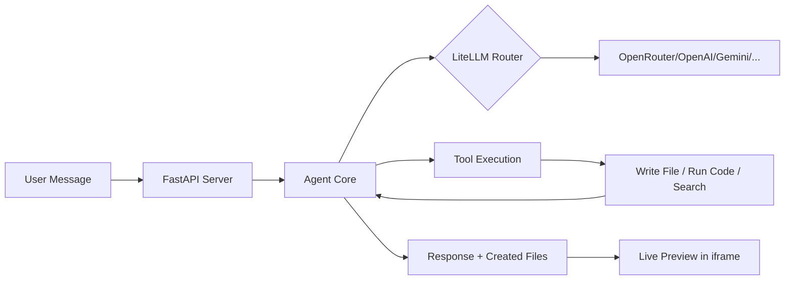

# 🧠 Agent OS — Autonomous Multi-Model AI Workspace

<div align="center">


[](https://python.org)
[](https://fastapi.tiangolo.com)
[](LICENSE)

**A Claude Workspace-like autonomous AI agent that creates real apps, runs code, and shows live previews — all from your browser.**

[Features](#-features) • [Quick Start](#-quick-start) • [Screenshots](#-screenshots) • [Providers](#-supported-providers) • [Architecture](#-architecture)

</div>

---

## ✨ Features

### 🤖 Autonomous Agent
- **ReAct Loop** — Thinks, acts, observes, and iterates autonomously (up to 15 steps)
- **9 Built-in Tools** — Search, browse web, write/read files, run Python, execute shell commands
- **Any Task** — "Create a todo app", "Search the web", "Run Python code", "Build a calculator"

### 🎨 Live Preview (Claude Artifacts-Style)
- **Split Layout** — Chat on the left, live preview on the right
- **Instant Rendering** — Created apps appear immediately in an interactive iframe
- **Code Viewer** — View source code of any created file
- **Output Panel** — See tool execution logs in real-time

### 📎 File & Camera Support
- **Attach Files** — Upload any file type to the workspace
- **Photo Upload** — Attach images from your device
- **Camera Capture** — Take photos directly from your webcam
- **Drag & Drop** — Drop files into the chat area

### ⚙️ Multi-Provider API Management
- **7 AI Providers** with dedicated settings cards
- **Per-provider API keys** — saved to `.env` for persistence
- **Custom Models** — Add any model ID from any provider
- **Local Models** — Ollama & LM Studio support (no API key needed)

---

## 🚀 Quick Start

### Prerequisites
- Python 3.10+
- An API key from any [supported provider](#-supported-providers)

### Installation

```bash
# Clone the repository
git clone https://github.com/Aj2280/Agent-OS.git
cd Agent-OS

# Install dependencies
pip install -r requirements.txt

# Set your API key (or add it later in Settings)
echo "OPENROUTER_API_KEY=your-key-here" > .env

# Start the server
python server.py
```

### Open in Browser
```
http://localhost:8000
```

That's it! 🎉

---

## 📸 Screenshots

### Chat + Live Preview
> Ask the agent to create an app → it writes the code → the app appears live in the preview panel

### Settings — 7 Providers
> Add API keys for OpenRouter, OpenAI, Gemini, Anthropic, Groq, Ollama, or LM Studio

### Workspace File Browser
> Browse all files created by the agent in the workspace directory

---

## 🔌 Supported Providers

| Provider | Models | API Key Required |
|----------|--------|:---:|
| 🌐 **OpenRouter** | 100+ models (GPT-4o, Claude, Llama, etc.) | ✅ |
| 🤖 **OpenAI** | GPT-4o, GPT-4 Turbo, GPT-3.5 | ✅ |
| 💎 **Google Gemini** | Gemini 2.0 Flash, 1.5 Pro | ✅ |
| 🧬 **Anthropic** | Claude 3.5 Sonnet, Claude 3 Opus | ✅ |
| ⚡ **Groq** | Llama 3.1, Mixtral (ultra-fast) | ✅ |
| 🏠 **Ollama** | Any local model (Llama, Mistral, etc.) | ❌ |
| 🖥️ **LM Studio** | Any GGUF model loaded locally | ❌ |

> **Tip:** OpenRouter is the easiest way to get started — one key gives you access to 100+ models.

---

## 🛠️ Built-in Tools

| Tool | Description |
|------|-------------|
| `google_search` | Search the web for real-time information |
| `fetch_url` | Read and extract content from web pages |
| `write_file` | Create files (code, HTML, documents) |
| `read_file` | Read existing files in the workspace |
| `list_files` | Browse directory contents |
| `create_directory` | Create folders |
| `run_python_code` | Execute Python code directly |
| `run_shell_command` | Run system commands |
| `think` | Internal planning for complex tasks |

---

## 🏗️ Architecture

```
Agent-OS/
├── server.py          # FastAPI backend — API routes, file serving
├── agent_core.py      # Autonomous ReAct agent with multi-provider routing
├── tools.py           # 9 tool implementations
├── main.py            # CLI interface (optional)
├── requirements.txt   # Python dependencies
├── .env               # API keys (auto-generated)
├── static/
│   ├── index.html     # Dashboard UI
│   ├── style.css      # Dark theme, glassmorphism
│   └── app.js         # Frontend logic, preview, uploads
└── workspace/         # Files created by the agent
```

### How It Works



1. **User sends a message** via the chat UI
2. **Agent plans** using the ReAct loop (Reason → Act → Observe)
3. **Tools are executed** — files written, code run, web searched
4. **Results are returned** — response in chat, apps in live preview
5. **Files are served** from the workspace via `/preview/` endpoint

---

## 📦 Dependencies

```
fastapi
uvicorn
litellm
duckduckgo-search
requests
beautifulsoup4
python-dotenv
python-multipart
```

---

## 🤝 Contributing

Contributions are welcome! Feel free to:
- Open issues for bugs or feature requests
- Submit pull requests with improvements
- Add new tools or providers

---

## 📄 License

MIT License — feel free to use, modify, and distribute.

---

<div align="center">

**Built with ❤️ by [Aj2280](https://github.com/Aj2280)**

⭐ Star this repo if you find it useful!

</div>
